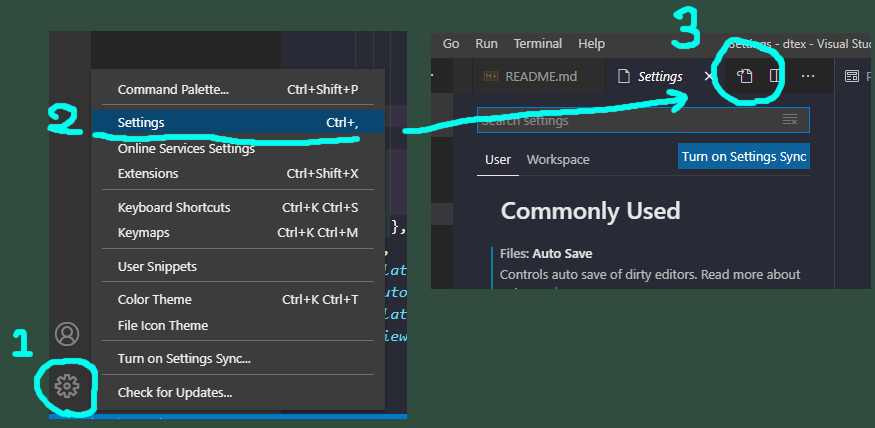
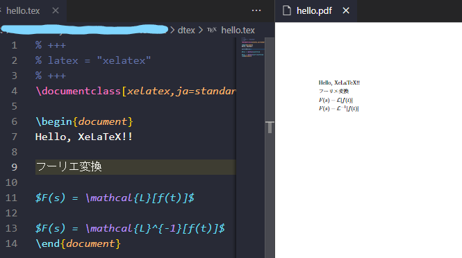

# dtex

TeX Live + 原ノ味フォントのDockerイメージでTeXのコンパイル環境を作る  

- TeX Live
  * 各種TeXの処理系(LuaTex, XeTeX etc.)やツール(llmk, latexmk etc.)やソースがほぼすべて入っている最強のパッケージ. インストーラからfull-installすれば一発でTeX環境が整う  
- 原ノ味フォント  
  * 源ノ明朝/源ノ角ゴシックをAdobe-Japan1対応にしたオープンソースフォント. ライセンスはSIL Open Font License  

後半で**VSCodeでTeXのプレビューを出し編集する方法**を示す  

# Contensts

- [dtex](#dtex)
- [Contensts](#contensts)
- [How to setup](#how-to-setup)
  - [Install Docker](#install-docker)
  - [Pull the image](#pull-the-image)
  - [Set the alias](#set-the-alias)
    - [Linux](#linux)
    - [Windows](#windows)
- [Usages](#usages)
- [Sample Usages](#sample-usages)
  - [Use llmk](#use-llmk)
  - [Use llmk from TOML](#use-llmk-from-toml)
  - [Use other compiler](#use-other-compiler)
- [Change the settings of VSCode](#change-the-settings-of-vscode)
  - [Setup](#setup)
  - [Quick start](#quick-start)
- [役立つかわからない情報](#役立つかわからない情報)
  - [VSCode](#vscode)
- [Reference](#reference)
- [Author](#author)

# How to setup 

流れはイメージをプルもしくはビルド -> コンテナを実行するエリアスの設定  

## Install Docker  

[これ](https://github.com/Sachi854/dtex/blob/master/install_docker.md)を見てインストールする    

## Pull the image  

ビルドは時間がかかるのでプルする. 4GB程度  

```bash
docker pull ghcr.io/sachi854/dtex:latest
```  

このイメージが気に食わないなビルドし新鮮なイメージを作る  

```bash
docker build https://raw.githubusercontent.com/Sachi854/dtex/master/Dockerfile -t ghcr.io/sachi854/dtex:latest --no-cache
```

## Set the alias  

コマンドを使用したパスをイメージにバインドし実行とフォントコンパイル時のキャッシュをボリュームに保存しておくオプションをラップしておく   

### Linux  

これを```.bashrc```等の設定ファイルの最後尾に追記する  

```bash:.bashrc
alias dtex="docker run --rm \
--mount type=bind,source=\"\$(pwd)\",target=/workdir \
--mount type=volume,source=ltcache,target=/usr/local/texlive/2020/texmf-var/luatex-cache \
ghcr.io/sachi854/dtex:latest"
```

### Windows  

[dtex.bat](https://github.com/Sachi854/dtex/blob/master/dtex.bat)を適当なディレクトリに配置してパスを通す  

```powershell
git colone https://github.com/Sachi854/dtex
mkdir ~/tools
cp ./dtex/dtex.bat ~/tools
# 最後に~/toolsのパスを通す
```

# Usages  

**VSCodeと連携する場合はPDFが勝手に吐き出されるのでUsageの項目は飛ばしてもかまわない**  

TeX Liveにはなんでも入っているので今まで使用していたツールを直接呼び出して使うことができる  
パスのみLinuxの記法(```/```)で書くように(cf. ```foo/bar/piyo```)  

Linuxの場合  

```bash
# Linux
dtex 使いたいコンパイラ texファイルのLinuxの記法で相対パス
```

Windowsの場合  

```powershell
# Windows
dtex.bat 使いたいコンパイラ texファイルのLinuxの記法で相対パス
```

# Sample Usages  

## Use llmk  

llmkはtexファイルの先頭にTOML形式(+++で囲む(%はTeXのコメント))で処理系を明示するとそれを使ってくれる  
今回, 処理系は```xelatex```を使えと指定した(```lualatex```等でもよい)   

xelatex.tex  

```tex
% +++
% latex = "xelatex"
% +++

\documentclass[xelatex,ja=standard,jafont=haranoaji]{bxjsarticle}
\begin{document}

XeTeXでニュートンの運動方程式

$m\frac{d^{2}x}{dt^{2}} = F$

\end{document}
```

コンパイル

```bash
#Linux
dtex llmk ./xelatex.tex
```

```powershell
#Windows
dtex.bat llmk ./xelatex.tex
```

ソース内にフォーマット書けば勝手にPDFを吐き出してくれるので便利  

---

なにも書かないと```latex```としてコンパイルされる 

llmk.tex

```tex:llmk.tex  
\documentclass[paper=a4,line_length=45zw]{jlreq}
\usepackage[deluxe,haranoaji]{luatexja-preset}

\begin{document}

llmk(latex)でニュートンの運動方程式

$m\frac{d^{2}x}{dt^{2}} = F$

\end{document}
```

コンパイル  

```bash
#Linux
dtex llmk ./llmk.tex
```

```powershell
#Windows
dtex.bat llmk ./llmk.tex
```


## Use llmk from TOML  

ソースファイルではなく外部のllmk.tomlファイルにあらかじめどうコンパイルするか記述しておくとこもできる  

a.texとb.texを同時にコンパイルする方法をしめす

```bash
workdir
  ├── a.tex
  ├── b.tex
  └── llmk.toml
```  

a.tex  

```tex
\documentclass[xelatex,ja=standard,jafont=haranoaji]{bxjsarticle}
\begin{document}
a.tex!!!
\end{document}
```

a.tex  

```tex
\documentclass[xelatex,ja=standard,jafont=haranoaji]{bxjsarticle}
\begin{document}
b.tex!!!
\end{document}
```

llmk.toml  

```toml
latex = "xelatex"
source = ["a.tex", "b.tex"]
```

```bash
dtex llmk
```

## Use other compiler

従来のコマンドも使用できる  

```
dtex lualatex ak47.tex
dtex ptex2pdf -l ak74.tex
dtex /bin/bash -c 'platex akm.tex && dvips akm.dvi && ps2pdf akm.ps'
```

# Change the settings of VSCode  

VSCodeは[ここ](https://code.visualstudio.com)からダウンロード  

開いたtexファイルをセーブ時にllmkでコンパイルされるよう設定をする  

## Setup

1. [LaTeX Workshop](https://marketplace.visualstudio.com/items?itemName=James-Yu.latex-workshop)をインストールする  
2. ```settings.json```に以下の内容を**jsonの文法にしたがって**追記する  

(settings.jsonの開き方)  


```json
{
  先頭...

  ...ほかの設定とか...., <- このカンマがない場合は付け足すこと. バグる

  "latex-workshop.latex.recipes": [
    {
      "name": "llmk",
      "tools": [
        "llmk"
      ]
    },
  ],
  "latex-workshop.latex.tools": [
    {
      "name": "llmk",
      "command": "docker",
      "args": [
        "run",
        "--rm",
        "--mount",
        "type=bind,source=%DIR%,target=/workdir",
        "--mount",
        "type=volume,source=ltcache,target=/usr/local/texlive/2020/texmf-var/luatex-cache", 
        "ghcr.io/sachi854/dtex:latest",
        "llmk",
        "%DOCFILE%",
      ]
    },
  ],
  "latex-workshop.latex.autoBuild.run": "onSave",
  "latex-workshop.view.pdf.viewer": "tab",
}
```

## Quick start    

hello.texを作って自動コンパイルとプレビューが使えるか試してみる  

---

ファイルを新しく作る  


名前をつけて保存  


```hello.tex```と名付けて保存  


llmkはtexファイルの先頭にTOML形式(+++で囲む(%はTeXのコメント))で処理系を明示するとそれを使ってくれる  
今回, 処理系は```xelatex```を使えと指定した(```lualatex```等でもよい)  

**必ず指定するように!!!**

```tex
% +++
% latex = "xelatex"
% +++
```

日本語を使う設定と本文を追記  

```tex
% +++
% latex = "xelatex"
% +++
\documentclass[xelatex,ja=standard,jafont=haranoaji,a4paper]{bxjsarticle}
\begin{document}
Hello, XeLaTeX!!
\end{document}
```

```<Ctrl + S>```でセーブしビルド  
もしくはビルドボタンを押してビルドする  


ビルド終了を待つ  


画面右上のボタンを押してプレビュー画面を開く  


開くとこうなる


本文を追加  

```tex
% +++
% latex = "xelatex"
% +++
\documentclass[xelatex,ja=standard,jafont=haranoaji,a4paper]{bxjsarticle}

\begin{document}
Hello, XeLaTeX!!

フーリエ変換

$F(s) = \mathcal{L}[f(t)]$

$F(s) = \mathcal{L}^{-1}[f(t)]$
\end{document}
```  

```<Ctrl + S>```でセーブしPDFが更新されるか確認する  

  

作られたPDFは```hello.tex```と同じディレクトリに保存される  

  

# 役立つかわからない情報  

もっとましなDockerfileの書き方やtypo等を見つけた場合はプルリクください  

## VSCode

- File -> Auto Saveを有効にすると勝手にセーブしれくれるので便利  
- [Local History](https://marketplace.visualstudio.com/items?itemName=xyz.local-history)を入れるとGitなしでもそこそこやっていける程度に勝手にバージョン管理しれくれる  
- [ここ](https://github.com/James-Yu/LaTeX-Workshop)見てsettings.jsonの設定を詰めればもっと柔軟にビルドできる  
- TeXファイルを編集中に左側のTEXマークをクリックするとLaTeX Workshopのタブが開きビルドやクリーンなどが行える  

# Reference

History of TeX  
https://www.slideshare.net/doraTeX/the-history-of-tex-and-its-recent-advances

TeX Live とは  
https://acetaminophen.hatenablog.com/entry/texadvent2016-20161205  

llmkとは  
https://blog.wtsnjp.com/2018/08/13/llmk-launch/  

LaTeX Workshopの設定方法  
https://qiita.com/maitaken/items/139f626bc8d895f2cc69  
https://github.com/James-Yu/LaTeX-Workshop  

原ノ味フォントのrepo  
https://github.com/trueroad/HaranoAjiFonts  

原ノ味フォントを利用するために参考にしたDockerfile  
https://github.com/doraTeX/Docker-TeXLive-haranoaji/  

# Author

Sachi854 s1701002@sendai-nct.jp

2021/01/24  
2021/01/25 最終更新
